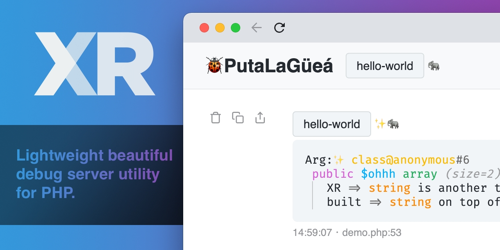

# XR

## Description

XR is a lightweight debug server utility for PHP. It can be used to debug PHP anywhere as it doesn't have any extra requirements.

## Links

* [Documentation](https://xr-docs.chevere.org/)
* [Repository](https://github.com/chevere/xr)
* [Packagist](https://packagist.org/packages/chevere/xr)
* [Hello, XR](https://rodolfo.is/2022/01/06/hello-xr/)
