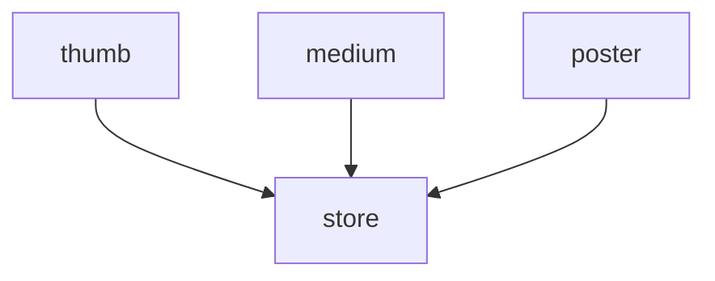
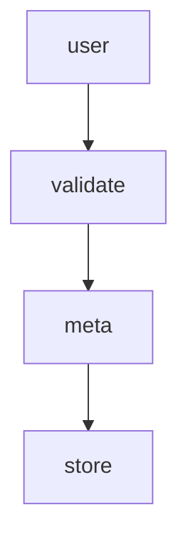
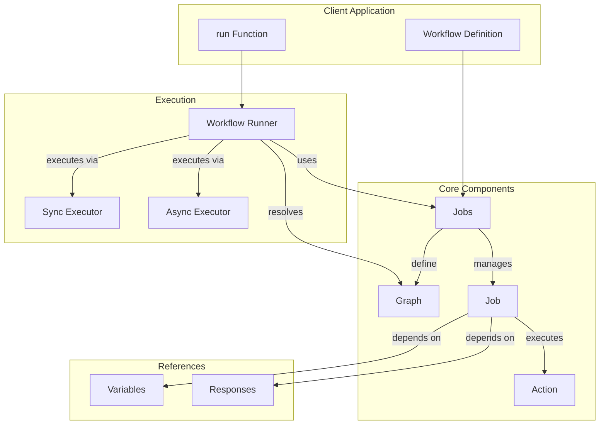

# Workflow

## Summary

A Workflow is a configurable stored procedure that will run one or more jobs. Jobs are independent from each other, but interconnected as you can pass response references between jobs. Jobs supports conditional running based on variables and previous job responses.

## Installing

Workflow is available through [Packagist](https://packagist.org/packages/chevere/workflow) and the repository source is at [chevere/workflow](https://github.com/chevere/workflow).

```sh
composer require chevere/workflow
```

## What it does?

The Workflow package provides a robust system for defining and executing structured procedures based on the [workflow pattern](https://en.wikipedia.org/wiki/Workflow_pattern). It enables to organize complex logic into a series of interconnected, independent jobs that can be executed in a controlled manner.

By breaking down monolithic procedures into modular workflow jobs, developers gain several advantages:

* Improved testability of individual components
* Better code organization and maintainability
* Reusable job definitions across different workflows
* Clear visualization of process flows
* Flexible execution patterns (sync/async)

::: tip 💡 Workflow introduction
 Read [Workflow for PHP](https://rodolfoberrios.com/2022/04/09/workflow-php/) at Rodolfo's blog for a compressive introduction to this package.
:::

## How to use

The Workflow package provides a set of core functions in the `Chevere\Workflow` namespace that allow you to build and manage workflow processes. These functions work together to create flexible, maintainable workflow definitions.

### Functions

| Function | Purpose                                                    |
| -------- | :--------------------------------------------------------- |
| workflow | Creates a new workflow container for organizing named jobs |
| sync     | Defines a synchronous job that blocks until completion     |
| async    | Defines an asynchronous job that runs non-blocking         |
| variable | Declares a workflow-level variable for job inputs          |
| response | Creates a reference to access previous job outputs         |

### Key concepts

* [Job](#job): Self-contained unit of work defined by [Action](https://chevere.org/packages/action)
* [Variable](#variable): Shared workflow-level inputs accessed by multiple jobs
* [Response](#response): Links between job outputs (`response()`) and inputs

## Workflow example

`php demo/chevere.php`

Create `MyAction` action by extending `Chevere\Action\Action`. You can also `use ActionTrait`.

```php
use Chevere\Action\Action;

class MyAction extends Action
{
    public function __invoke(string $foo): string
    {
        return "Hello, {$foo}";
    }
}
```

Create Workflow with your `MyAction` Job:

```php
use function Chevere\Workflow\{workflow,sync,variable,response};

$workflow = workflow(
    greet: sync(
        new MyAction(),
        foo: variable('super'),
    ),
    capo: sync(
        new MyAction(),
        foo: response('greet'),
    ),
);
```

Run the Workflow:

```php
use function Chevere\Workflow\run;

$hello = run(
    $workflow,
    super: 'Chevere',
);
echo $hello->response('greet')->string() . PHP_EOL;
// Hello, Chevere
echo $hello->response('capo')->string() . PHP_EOL;
// Hello, Hello, Chevere
```

## Variable

Use function `variable` to declare a Workflow variable that will be injected when running the workflow. Variables allow you to pass external values into your workflow jobs during execution.

```php
use function Chevere\Workflow\variable;

// Basic variable declaration
variable('myVar');

// Usage in a job
sync(
    new MyAction(),
    parameter: variable('myVar')
);
```

When running the workflow, you must provide values for all declared variables:

```php
use function Chevere\Workflow\run;

run($workflow, myVar: 'some value');
```

## Response

Use function `response` to declare a reference to a response returned by a previous Job. This allows you to chain job outputs as inputs to subsequent jobs.

🪄 When using a response it will **auto declare** the referenced Job as a [dependency](#dependencies), ensuring proper execution order.

```php
use function Chevere\Workflow\response;

// Basic response declaration
response('job1');

// Usage in a Workflow
workflow(
    job1: sync(
        new SomeAction(),
    ),
    job2: sync(
        new MyAction(),
        parameter: response('job1')
    );
);
```

References can be also made on a response member identified by `key`.

```php
use function Chevere\Workflow\response;

response('job1', 'id');
```

## Job

The `Job` class defines an [Action](https://chevere.org/packages/action) that can be executed as part of a workflow.

### Arguments

Job arguments can be passed in three ways:

* **As-is values**: Direct values passed to the Action
* **Variables**: Workflow-level inputs declared using the `variable` function
* **Responses**: References to previous job outputs declared using the `response` function

```php
class SomeAction extends Action
{
    public function __invoke(
        string $context,
        int $userId,
        mixed ...$bag,
    ): void
    {
        // On runtime:
        // $context = 'public'
        // $userId = (( user.id response ))
        // $bag = ['group' => 'admin', 'mask' => 1024]
    }
}

$workflow = workflow(
    user: sync(
        new GetUser(),
        request: variable('userId')
    ),
    job1: sync(
        new SomeAction(),
        context: 'public',               // As-is value
        userId: variable('userId'),      // Variable
        group: response('user', 'group'),// Response
        mask: 1024,                      // As-is value
    );
);

run($workflow, userId: 123);
```

In the example above:

* The `context` argument is passed as-is with the value `public`.
* The `userId` argument is dynamically provided as a variable.
* The `group` argument is dynamically provided as a response from a previous job.
* The `mask` argument is passed as-is with the value `1024`.

When running the Workflow, these arguments will be matched against the parameters defined in the [main method](https://chevere.org/packages/action.html#main-method) of `SomeAction`.

### Asynchronous

Use function `async` to create an asynchronous job, which runs non-blocking.

**Important:** When using `async` jobs, your Actions must support [serialization](https://www.php.net/manual/en/function.serialize.php). For Actions that work with non-serializable resources like:

* Database connections
* File handles
* Stream resources
* Network sockets

You must use `sync` jobs instead.

In the example below a Workflow describes an image creation procedure for multiple image sizes.

```php
use function Chevere\Workflow\{sync,async,response,variable,workflow};

workflow(
    thumb: async(
        new ImageResize(),
        image: variable('image'),
        width: 100,
        height: 100,
        fit: 'thumb'
    ),
    medium: async(
        new ImageResize(),
        image: variable('image'),
        width: 500,
        fit: 'resizeByW'
    ),
    store: sync(
        new StoreFiles(),
        response('thumb', 'filename'),
        response('medium', 'filename'),
    ),
);
```

* `variable('image')` declares a [Variable](#variable).
* `response('thumb', 'filename')` and `response('medium', 'filename')` declares a [Response](#response) reference.

The graph for this Workflow says that `thumb`, `medium` and `poster` run non-blocking in parallel. Job `store` runs blocking (another node).



```php
$workflow->jobs()->graph()->toArray();
// contains
[
    ['thumb', 'medium', 'poster'],
    ['store']
];
```

To complete the example, here's how to [Run](#running) the Workflow previously defined:

```php
use function Chevere\Workflow\run;

run(
    workflow: $workflow,
    arguments: [
        'image' => '/path/to/file',
    ]
);
```

### Synchronous

Use function `sync` to create a synchronous job, which block execution until it gets resolved.

In the example below a Workflow describes an image uploading procedure.

```php
use function Chevere\Workflow\{sync,response,variable,workflow};

workflow(
    user: sync(
        new GetUser(),
        request: variable('payload')
    ),
    validate: sync(
        new ValidateImage(),
        mime: 'image/png',
        file: variable('file')
    ),
    meta: sync(
        new GetMeta(),
        file: variable('file'),
    ),
    store: sync(
        new StoreFile(),
        file: variable('file'),
        name: response('meta', 'name'),
        user: response('user')
    ),
);
```

* `variable('payload')` and `variable('file')` declares a [Variable](#variable).
* `response('meta', 'name')` and `response('user')` declares a [Response](#response) reference.

The graph for this Workflow says that all jobs run one after each other as all jobs are defined using `sync`.



```php
$workflow->jobs()->graph()->toArray();
// contains
[
    ['user'],
    ['validate'],
    ['meta'],
    ['store']
];
```

To complete the example, here's how to [Run](#running) the Workflow previously defined:

```php
use function Chevere\Workflow\run;

run(
    $workflow,
    payload: $_REQUEST,
    file: '/path/to/file',
);
```

### Conditional running

Method `withRunIf` enables to pass arguments of type [Variable](#variable) or [Response](#response) for conditionally running a Job.

```php
sync(
    new CompressImage(),
    file: variable('file')
)
    ->withRunIf(
        variable('compressImage'),
        response('SomeAction', 'doImageCompress')
    )
```

For the code above, all conditions must meet to run the Job and both variable `compressImage` and the reference `SomeAction:doImageCompress` must be `true` to run the job.

### Dependencies

Use `withDepends` method to explicit declare previous jobs as dependencies. The dependent Job won't run until the dependencies are resolved.

```php
job(new SomeAction())
    ->withDepends('myJob');
```

## Running

To run a Workflow use the `run` function by passing a Workflow and its variables (if any).

```php
use function Chevere\Workflow\run;

$run = run($workflow, ...$variables);
```

### Access Job response

Use `response` to retrieve a job response as a `Typed` object which can be used to get a typed response.

```php
$thumbFile = $run->response('thumb')->string();
```

🪄 If the response is of type `array` you can shortcut key type-safe access.

```php
$id = $run->response('user', 'id')->int();
```

### WorkflowTrait

The `WorkflowTrait` provides methods `execute`  and `run` for easing handling a Workflow within a class.

```php
use Chevere\Workflow\WorkflowTrait;

class Something
{
    use WorkflowTrait;

    public function __construct()
    {
        $workflow = workflow(
            job1: sync(
                new MyAction(),
                foo: variable('bar')
            )
        );
        // Use execute to run the Workflow
        $this->execute($workflow, bar: 'baz');
    }
}

$some = new Something();
$bar = $some->run()->response('job1')->string();
```

### Exception handling

When running a Workflow, if a Job fails a `WorkflowException` will be thrown. This is an exception wrapper for the job that thrown the exception.

```php
try {
    $run = run($workflow, ...$variables);
} catch (WorkflowException $e) {
    // Job that thrown the exception
    $e->name;
    // Job instance that thrown the exception
    $e->job;
    // The exception thrown by the Job
    $e->throwable;
}

// If using WorkflowTrait
try {
    $this->execute($workflow, ...$variables);
    $run = $this->run();
} catch (WorkflowException $e) {
    // ...
}
```

## Demo

See the [demo](https://github.com/chevere/workflow/tree/2.0/demo) directory for a set of examples.

## Testing

Workflow provides several approaches for testing your implementations. While the Workflow itself doesn't need testing (it's a configuration), you should test:

1. Job actions (unit tests)
2. Workflow execution order (graph)
3. Job responses
4. Exception handling

### Testing Job Actions

The primary testing focus should be on your Action implementations:

```php
use PHPUnit\Framework\TestCase;

class MyActionTest extends TestCase
{
    public function testAction(): void
    {
        $action = new MyAction();
        // 🪄 Chevere automatically validates Action I/O
        $response = $action(foo: 'bar');
        $this->assertSame('expected', $response);
    }
}
```

### Testing Workflow Graph

Verify the execution order by testing the Workflow graph:

```php
public function testWorkflowOrder(): void
{
    $expectedGraph = [
        ['job1', 'job2'], // parallel jobs
        ['job3'],         // depends on job1, job2
    ];
    $this->assertSame(
        $expectedGraph,
        $workflow->jobs()->graph()->toArray()
    );
}
```

### Testing Job Responses

Test how jobs interact by checking their responses:

```php
public function testJobResponses(): void
{
    $run = run($workflow, input: 'test');
    // Access typed responses
    $this->assertSame(
        123,
        $run->response('job1')->int()
    );
    $this->assertSame(
        'test',
        $run->response('job2')->string()
    );
    // Access array responses
    $this->assertSame(
        10.2,
        $run->response('job3', 'rate')->float()
    );
}
```

### Testing Exception Handling

Use `ExpectWorkflowExceptionTrait` to test error scenarios:

```php
use Chevere\Workflow\Traits\ExpectWorkflowExceptionTrait;
use function Chevere\Workflow\run;

class WorkflowTest extends TestCase
{
    use ExpectWorkflowExceptionTrait;

    public function testFailingJob(): void
    {
        $this->expectWorkflowException(
            closure: fn () => run($workflow, input: 'invalid'),
            exception: LogicException::class,
            job: 'validation',
            message: 'Invalid input'
        );
    }
}
```

## Architecture

The architecture of the Workflow package is designed to provide a clear separation of concerns, making it easier to define, manage, and execute workflows. The following diagram illustrates the core components and their interactions:


