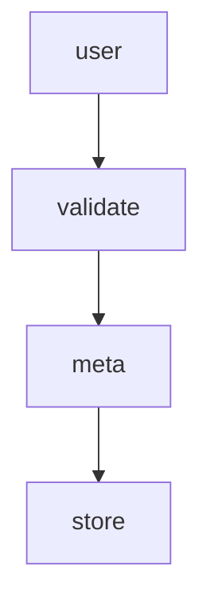
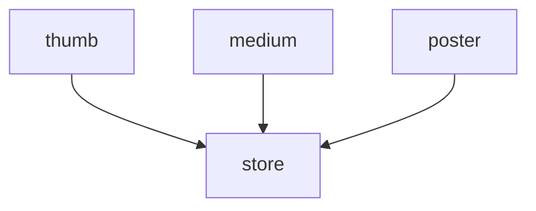

# Workflow

## Summary

A Workflow is a configurable stored procedure that will run one or more jobs. Jobs are independent from each other, but interconnected as you can pass response references between jobs. Jobs supports conditional running based on variables and previous job responses.

## Installing

Workflow is available through [Packagist](https://packagist.org/packages/chevere/workflow) and the repository source is at [chevere/workflow](https://github.com/chevere/workflow).

```sh
composer require chevere/workflow
```

## What it does?

The Workflow package provides tooling for defining an execution procedure based on the [workflow pattern](https://en.wikipedia.org/wiki/Workflow_pattern). Its purpose is to abstract logic instructions as units of interconnected independent jobs.

Instead of building a monolithic procedure, you define a Workflow made of jobs, enabling developers to easy test and maintain re-usable multi-purpose logic.

::: tip 💡 Workflow introduction
 Read [Workflow for PHP](https://rodolfoberrios.com/2022/04/09/workflow-php/) at Rodolfo's blog for a compressive introduction to this package.
:::

## How to use

Workflow provides the following functions at the `Chevere\Workflow` namespace. Use these functions to define a Workflow, its variables and response references for named jobs.

| Function | Purpose                              |
| -------- | ------------------------------------ |
| workflow | Create workflow made of named jobs   |
| sync     | Create synchronous blocking job      |
| async    | Create asynchronous non-blocking job |
| variable | Define workflow-level variable       |
| response | Define a job response reference      |

* A Job is defined by its [Action](https://chevere.org/packages/action)
* Jobs are independent from each other, define shared variables using function `variable()`
* Reference {job#A response} -> {job#B input} by using function `response()`

To produce logic with this package:

1. Create a Workflow using function `workflow`
2. Define jobs using function `sync` or `async`
3. Run the Workflow using function `run`

## Creating Workflow

To create a Workflow define its named Jobs.

A [Job](#creating-job) is created by passing an [Action](https://chevere.org/packages/action) and its *expected* run arguments which can be raw values,  [Variables](#variable) and/or [Responses](#response) to another job's output.

The syntax for writing Workflow jobs require `name` for job's name, `sync/async` depending on job run method, and named `parameter` binding for each `Action::main` parameter.

```plain
<name>: <sync|async>(
    <action>,
    <parameter>: <variable|reference|raw>,
)
```

For example, for the given `MyAction` action:

```php
use function Chevere\Action\Action;

class MyAction extends Action
{
    protected function main(string $foo, string $bar): array
    {
        return [];
    }
}
```

You will be able to write a Workflow like this:

```php
use function Chevere\Workflow\sync;

workflow(
    greet: sync(
        new MyAction(),
        foo: variable('super'),
        bar: variable('taldo'),
    )
);
```

### With synchronous jobs

Use function `sync` to create a synchronous job, which block execution until it gets resolved.

In the example below a Workflow describes an image uploading procedure.

```php
use function Chevere\Workflow\sync;
use function Chevere\Workflow\response;
use function Chevere\Workflow\variable;
use function Chevere\Workflow\workflow;

workflow(
    user: sync(
        new GetUser(),
        request: variable('payload')
    ),
    validate: sync(
        new ValidateImage(),
        mime: 'image/png',
        file: variable('file')
    ),
    meta: sync(
        new GetMeta(),
        file: variable('file'),
    ),
    store: sync(
        new StoreFile(),
        file: variable('file'),
        name: response('meta', 'name'),
        user: response('user')
    ),
);
```

* `variable('payload')` and `variable('file')` declares a [Variable](#variable).
* `response('meta', 'name')` and `response('user')` declares a [Response](#response) reference.

The graph for this Workflow says that all jobs run one after each other as all jobs are defined using `sync`.



```php
$workflow->jobs()->graph()->toArray();
// contains
[
    ['user'],
    ['validate'],
    ['meta'],
    ['store']
];
```

To complete the example, here's how to [Run](#running-a-workflow) the Workflow previously defined:

```php
use function Chevere\Workflow\run;

run(
    $workflow,
    payload: $_REQUEST,
    file: '/path/to/file',
);
```

### With asynchronous jobs

Use function `async` to create an asynchronous job, which runs non-blocking.

In the example below a Workflow describes an image creation procedure for multiple image sizes.

```php
use function Chevere\Workflow\sync;
use function Chevere\Workflow\response;
use function Chevere\Workflow\variable;
use function Chevere\Workflow\workflow;

workflow(
    thumb: async(
        new ImageResize(),
        image: variable('image'),
        width: 100,
        height: 100,
        fit: 'thumb'
    ),
    medium: async(
        new ImageResize(),
        image: variable('image'),
        width: 500,
        fit: 'resizeByW'
    ),
    store: sync(
        new StoreFiles(),
        response('thumb', 'filename'),
        response('medium', 'filename'),
    ),
);
```

* `variable('image')` declares a [Variable](#variable).
* `response('thumb', 'filename')` and `response('medium', 'filename')` declares a [Response](#response) reference.

The graph for this Workflow says that `thumb`, `medium` and `poster` run non-blocking in parallel. Job `store` runs blocking (another node).



```php
$workflow->jobs()->graph()->toArray();
// contains
[
    ['thumb', 'medium', 'poster'],
    ['store']
];
```

To complete the example, here's how to [Run](#running-a-workflow) the Workflow previously defined:

```php
use function Chevere\Workflow\run;

run(
    workflow: $workflow,
    arguments: [
        'image' => '/path/to/file',
    ]
);
```

### Variable

Use function `variable` to declare a Workflow variable. This denotes a variable which must be injected by at Workflow run layer.

```php
use function Chevere\Workflow\variable;

variable('myVar');
```

### Response

Use function `response` to declare a Job response reference to a response returned by a previous Job.

🪄 When using a response it will **auto declare** the referenced Job as [dependency](#dependencies).

```php
use function Chevere\Workflow\response;

response(job: 'task');
```

References can be also made on a response member identified by `key`.

```php
use function Chevere\Workflow\response;

response(job: 'task', key: 'name');
```

## Creating Job

The `Job` class defines an [Action](https://chevere.org/packages/action) with arguments which can be passed passed "as-is", [variable](#variable) or [response](#response) on constructor using named arguments.

### Synchronous job

```php
use function Chevere\Workflow\job;

sync(
    new SomeAction(),
    ...$argument
);
```

### Asynchronous job

```php
use function Chevere\Workflow\job;

async(
    new SomeAction(),
    ...$argument
);
```

**Note:** Actions must support [serialization](https://www.php.net/manual/en/function.serialize.php) for being used on `async` jobs. For not serializable Actions as these interacting with connections (namely streams, database clients, etc.) you should use `sync` job.

### Job variables and references

```php
sync(
    new SomeAction(),
    context: 'public',
    role: variable('role'),
    userId: response('user', 'id'),
);
```

For the code above, argument `context` will be passed "as-is" (`public`) to `SomeAction`, arguments `role` and `userId` will be dynamic provided. When running the Workflow these arguments will be matched against the Parameters defined at the [main method](https://chevere.org/packages/action#mai-method) for `SomeAction`.

### Conditional running

Method `withRunIf` enables to pass arguments of type [Variable](#variable) or [Response](#response) for conditionally running a Job.

```php
sync(
    new CompressImage(),
    file: variable('file')
)
    ->withRunIf(
        variable('compressImage'),
        response('SomeAction', 'doImageCompress')
    )
```

For the code above, all conditions must meet to run the Job and both variable `compressImage` and the reference `SomeAction:doImageCompress` must be `true` to run the job.

### Dependencies

Use `withDepends` method to explicit declare previous jobs as dependencies. The dependent Job won't run until the dependencies are resolved.

```php
job(new SomeAction())
    ->withDepends('myJob');
```

## Running a Workflow

To run a Workflow use the `run` function by passing a Workflow and an `array` for its variables (if any).

```php
use function Chevere\Workflow\run;

$run = run($workflow, ...$variables);
```

Use `response` to retrieve a job response as a `CastArgument` object which can be used to get a typed response.

```php
$thumbFile = $run->response('thumb')->string();
```

If the response is of type `array` you can wrap using `cast` as needed.

```php
use function Chevere\Parameter\cast;

$id = $run->response('user')->array()['id']; // ? type
$id = cast($id)->int(); // int type
```

## Demo

See the [demo](https://github.com/chevere/workflow/tree/1.0/demo) directory for a set of examples.

## Debugging

When working with this package you may want to debug the Workflow to ensure that the jobs are declared as expected.

To debug a Workflow inspect the Jobs graph. It will show the job names and their dependencies for each execution level.

```php
$workflow->jobs()->graph()->toArray();
[
    ['job1', 'job2'], // 1st level
    ['job3', 'job4'], // 2nd level
    ['job5'],         // 3rd level
];
```

For each level jobs will run in parallel, but the next level will run after the previous level gets resolved.

> [!NOTE]
> For runtime debugging is strongly recommended to use a non-blocking debugger like [xrDebug](https://xrdebug.com).

## Testing

Workflow checks on variables, references and any other configuration so you don't have to worry about that.

Testing the Workflow itself is not necessary as it's just a configuration. What you need to test is the Workflow definition and their Jobs (Actions).

### Testing Workflow

For testing a Workflow what you need to assert is the expected Workflow graph (execution order).

```php
assertSame(
    $expectedGraph,
    $workflow->jobs()->graph()->toArray()
);
```

### Testing Job

For testing a Job what you need to test is the Action that defines that given Job against the response from the Action `main` method.

```php
$action = new MyAction();
assertSame(
    $expected,
    $action->main(...$arguments)
);
```
