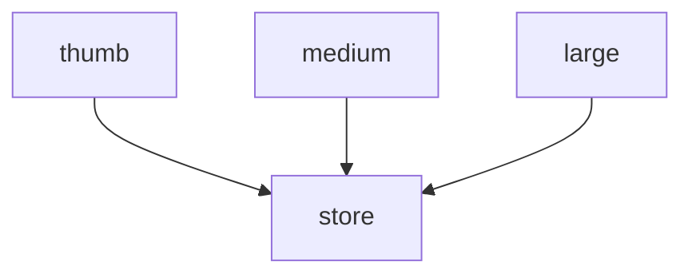

# Workflow

## Summary

**Chevere Workflow** is a PHP library for building and executing multi-step procedures with automatic dependency resolution. Define independent jobs that can run synchronously or asynchronously, pass data between them using typed responses, and let the engine handle execution order automatically.

**Key features:**

* **Declarative job definitions** - Define what to do, not how to orchestrate it
* **Automatic dependency graph** - Jobs execute in optimal order based on their dependencies
* **Sync and async execution** - Mix blocking and non-blocking jobs freely
* **Type-safe responses** - Access job outputs with full type safety
* **Conditional execution** - Run jobs based on variables or previous responses
* **Built-in retry policies** - Handle transient failures automatically
* **Testable components** - Each job is independently testable

## Installing

Workflow is available through [Packagist](https://packagist.org/packages/chevere/workflow) and the repository source is at [chevere/workflow](https://github.com/chevere/workflow).

```sh
composer require chevere/workflow
```

## Quick Start

Here's a minimal example to get you started:

```php
use function Chevere\Workflow\{workflow, sync, variable, run};

// 1. Define a workflow with jobs
$workflow = workflow(
    greet: sync(
        fn(string $name): string => "Hello, {$name}!",
        name: variable('username')
    )
);

// 2. Run with variables
$result = run($workflow, username: 'World');

// 3. Get typed responses
echo $result->response('greet')->string();
// Output: Hello, World!
```

## Core Concepts

Workflow is built around four main concepts:

| Concept      | Description                                                       |
| ------------ | ----------------------------------------------------------------- |
| **Job**      | A unit of work (Action class or Closure) that produces a response |
| **Variable** | External input provided when running the workflow                 |
| **Response** | Reference to output from a previous job                           |
| **Graph**    | Automatic execution order based on job dependencies               |

### How It Works

1. You define jobs using `sync()` or `async()` functions
2. Jobs declare their inputs: literal values, `variable()` references, or `response()` from other jobs
3. The engine builds a dependency graph automatically
4. Jobs execute in optimal order (parallel when possible)
5. Access typed responses after execution

## Functions Reference

| Function     | Purpose                                   |
| ------------ | ----------------------------------------- |
| `workflow()` | Create a workflow from named jobs         |
| `sync()`     | Create a synchronous (blocking) job       |
| `async()`    | Create an asynchronous (non-blocking) job |
| `variable()` | Declare a runtime variable                |
| `response()` | Reference another job's output            |
| `run()`      | Execute a workflow with variables         |

---

## Jobs

Jobs are the building blocks of a workflow. Each job wraps an executable unit (Action or Closure) and declares its input arguments.

### Creating Jobs with Closures

Use closures for simple, inline operations:

```php
use function Chevere\Workflow\{workflow, sync, async, variable, response, run};

$workflow = workflow(
    // Simple calculation
    add: sync(
        fn(int $a, int $b): int => $a + $b,
        a: 10,
        b: variable('number')
    ),
    // Format the result
    format: sync(
        fn(int $sum): string => "Sum: {$sum}",
        sum: response('add')
    )
);

$result = run($workflow, number: 5);
echo $result->response('format')->string(); // Sum: 15
```

### Creating Jobs with Action Classes

For complex or reusable logic, use [Action](https://chevere.org/packages/action) classes:

```php
use Chevere\Action\Action;

class FetchUser extends Action
{
    public function __invoke(int $userId): array
    {
        // Fetch user from database
        return ['id' => $userId, 'name' => 'John', 'email' => 'john@example.com'];
    }
}

class SendEmail extends Action
{
    public function __invoke(string $email, string $subject): bool
    {
        // Send email logic
        return true;
    }
}
```

```php
$workflow = workflow(
    user: sync(
        FetchUser::class,
        userId: variable('id')
    ),
    notify: sync(
        SendEmail::class,
        email: response('user', 'email'),
        subject: 'Welcome!'
    )
);

$result = run($workflow, id: 123);
```

### Sync vs Async Jobs

**Synchronous jobs** (`sync`) block execution until complete. Use for operations that must run in sequence:

```php
workflow(
    first: sync(ActionA::class),  // Runs first
    second: sync(ActionB::class), // Waits for first
    third: sync(ActionC::class),  // Waits for second
);
// Graph: first → second → third
```

**Asynchronous jobs** (`async`) run concurrently when they have no dependencies:

```php
workflow(
    resize1: async(ResizeImage::class, size: 'thumb'),
    resize2: async(ResizeImage::class, size: 'medium'),
    resize3: async(ResizeImage::class, size: 'large'),
    store: sync(StoreFiles::class, files: response('resize1'), ...)
);
// Graph: [resize1, resize2, resize3] → store
```

### Job Arguments

Jobs accept three types of arguments:

```php
workflow(
    example: sync(
        MyAction::class,
        literal: 'fixed value',           // Literal value
        dynamic: variable('userInput'),   // Runtime variable
        chained: response('otherJob'),    // Previous job output
    )
);
```

Jobs can define I/O rules via [chevere/parameter](https://chevere.org/packages/parameter). Workflow derives parameter and return definitions from the closure signature or Action reflection, and validates inputs and responses at runtime.

---

## Variables

Variables are placeholders for values provided at runtime. Declare them with `variable()`:

```php
$workflow = workflow(
    job1: sync(
        SomeAction::class,
        name: variable('userName'),
        age: variable('userAge')
    )
);

// Provide values when running
$result = run($workflow, userName: 'Alice', userAge: 30);
```

All declared variables must be provided when running the workflow.

---

## Responses

Use `response()` to pass output from one job to another. This automatically establishes a dependency.

```php
$workflow = workflow(
    fetch: sync(
        FetchData::class,
        url: variable('endpoint')
    ),
    process: sync(
        ProcessData::class,
        data: response('fetch')  // Gets entire response from 'fetch'
    ),
    extract: sync(
        ExtractField::class,
        value: response('fetch', 'items')  // Gets 'items' key from response
    )
);
```

### Accessing Nested Response Keys

When a job returns an array, access specific keys:

```php
response('user')           // Entire response
response('user', 'id')     // $response['id']
response('user', 'profile') // $response['profile']
```

---

## Execution Graph

The workflow engine automatically builds an execution graph based on job dependencies. Jobs without dependencies run in parallel (when using `async`), while dependent jobs wait for their dependencies.

```php
$workflow = workflow(
    // Independent async jobs run in parallel
    thumb: async(ImageResize::class, size: 'thumb', file: variable('image')),
    medium: async(ImageResize::class, size: 'medium', file: variable('image')),
    large: async(ImageResize::class, size: 'large', file: variable('image')),
    // Sync job waits for all above
    store: sync(
        StoreFiles::class,
        thumb: response('thumb'),
        medium: response('medium'),
        large: response('large')
    )
);

// View the execution graph
$graph = $workflow->jobs()->graph()->toArray();
// [
//     ['thumb', 'medium', 'large'],  // Level 0: parallel
//     ['store']                       // Level 1: after dependencies
// ]
```



---

## Running Workflows

Execute a workflow with the `run()` function:

```php
use function Chevere\Workflow\run;

// Basic execution
$result = run($workflow, var1: 'value1', var2: 'value2');

// With dependency injection container
$result = run($workflow, $container, var1: 'value1');
```

### Accessing Responses

The run result provides type-safe access to job responses:

```php
$result = run($workflow, ...);

// Get typed responses
$result->response('jobName')->string();     // string
$result->response('jobName')->int();        // int
$result->response('jobName')->float();      // float
$result->response('jobName')->bool();       // bool
$result->response('jobName')->array();      // array

// Access array keys directly
$result->response('jobName', 'key')->string();
$result->response('jobName', 'nested', 'key')->int();
```

### Check Skipped Jobs

When using conditional execution, check which jobs were skipped:

```php
if ($result->skip()->contains('optionalJob')) {
    // Job was skipped
}
```

---

## Conditional Execution

Control whether a job runs using `withRunIf()` (run when conditions are met) or `withRunIfNot()` (skip when conditions are met). Both methods accept the same kinds of conditions and are evaluated at run-time.

### Accepted condition types

* `boolean` literal — evaluated directly
* `variable('name')` — runtime argument coerced to boolean
* `response('job')` or `response('job', 'key')` — uses another job's output
* `Closure` — invokes a closure passing the current `RunInterface` context

---

```php
use function Chevere\Workflow\{workflow, sync, variable, run, response};

$workflow = workflow(
    isTooBig: sync(
        fn(string $path, int $maxBytes): bool => filesize($path) > $maxBytes,
        path: variable('file'),
        maxBytes: variable('maxBytes')
    ),
    compress: sync(
        CompressImage::class,
        file: variable('file')
    )->withRunIf(
        true,                       // literal
        variable('shouldCompress'), // workflow variable
        response('isTooBig'),       // job response value
        fn(RunInterface $run) => $run->variable('shouldCompress')->bool(), // closure condition variable
        fn(RunInterface $run) => $run->response('isTooBig')->bool(), // closure condition using response
    )
);
$result = run($workflow,
    file: '/path/to/image.jpg',
    shouldCompress: true,
    maxBytes: 1_000_000
);
```

---

## Explicit Dependencies

While `response()` creates implicit dependencies, use `withDepends()` for explicit control:

```php
$workflow = workflow(
    setup: async(SetupAction::class),
    process: async(
        ProcessAction::class,
        data: variable('input')
    )->withDepends('setup')  // Wait for setup even without using its response
);
```

---

## Retry Policy

Configure automatic retries for jobs that may fail transiently:

```php
$workflow = workflow(
    fetch: sync(
        FetchFromApi::class,
        url: variable('endpoint')
    )->withRetry(
        timeout: 300,     // Max 300 seconds total
        maxAttempts: 5,   // Try up to 5 times
        delay: 10         // Wait 10 seconds between attempts
    )
);
```

| Parameter     | Type          | Default | Description                                   |
| ------------- | ------------- | ------- | --------------------------------------------- |
| `timeout`     | `int<0, max>` | `0`     | Max execution time in seconds (0 = unlimited) |
| `maxAttempts` | `int<1, max>` | `1`     | Total attempts including initial              |
| `delay`       | `int<0, max>` | `0`     | Seconds between retries (0 = immediate)       |

Retry delays use non-blocking sleep, making them safe for async runtimes.

---

## Exception Handling

When a job fails, a `WorkflowException` wraps the original exception:

```php
use Chevere\Workflow\Exceptions\WorkflowException;

try {
    $result = run($workflow, ...);
} catch (WorkflowException $e) {
    echo $e->name;        // Name of the failed job
    echo $e->job;         // Job instance
    echo $e->throwable;   // Original exception
}
```

---

## Using WorkflowTrait

For class-based workflow management, use `WorkflowTrait`:

```php
use Chevere\Workflow\Traits\WorkflowTrait;
use function Chevere\Workflow\{workflow, sync, variable};

class OrderProcessor
{
    use WorkflowTrait;

    public function process(int $orderId): void
    {
        $workflow = workflow(
            validate: sync(ValidateOrder::class, id: variable('orderId')),
            charge: sync(ChargePayment::class, order: response('validate')),
            fulfill: sync(FulfillOrder::class, order: response('charge'))
        );

        $this->execute($workflow, orderId: $orderId);
    }

    public function getResult(): string
    {
        return $this->run()->response('fulfill')->string();
    }
}
```

---

## Testing

### Testing Actions

Test your Action classes independently:

```php
use PHPUnit\Framework\TestCase;

class FetchUserTest extends TestCase
{
    public function testFetchUser(): void
    {
        $action = new FetchUser();
        $result = $action(userId: 123);

        $this->assertSame(123, $result['id']);
        $this->assertArrayHasKey('name', $result);
    }
}
```

### Testing Workflow Graph

Verify execution order:

```php
public function testWorkflowGraph(): void
{
    $workflow = workflow(
        a: async(ActionA::class),
        b: async(ActionB::class),
        c: sync(ActionC::class, x: response('a'), y: response('b'))
    );

    $graph = $workflow->jobs()->graph()->toArray();

    $this->assertSame([['a', 'b'], ['c']], $graph);
}
```

### Testing Responses

Test complete workflow execution:

```php
public function testWorkflowResponses(): void
{
    $result = run($workflow, input: 'test');

    $this->assertSame('expected', $result->response('job1')->string());
    $this->assertSame(42, $result->response('job2', 'count')->int());
}
```

### Testing Exceptions

Use `ExpectWorkflowExceptionTrait` for error scenarios:

```php
use Chevere\Workflow\Traits\ExpectWorkflowExceptionTrait;

class WorkflowExceptionTest extends TestCase
{
    use ExpectWorkflowExceptionTrait;

    public function testJobFailure(): void
    {
        $this->expectWorkflowException(
            closure: fn() => run($workflow, input: 'invalid'),
            exception: InvalidArgumentException::class,
            job: 'validate',
            message: 'Invalid input provided'
        );
    }
}
```

---

## Real-World Examples

### Image Processing Pipeline

```php
$workflow = workflow(
    // Parallel image resizing
    thumb: async(
        ImageResize::class,
        file: variable('image'),
        width: 150,
        height: 150
    ),
    medium: async(
        ImageResize::class,
        file: variable('image'),
        width: 800
    ),
    // Store after all resizing completes
    store: sync(
        StoreFiles::class,
        thumb: response('thumb'),
        medium: response('medium'),
        directory: variable('outputDir')
    )
);

$result = run($workflow,
    image: '/uploads/photo.jpg',
    outputDir: '/processed/'
);
```

### User Registration Flow

```php
$workflow = workflow(
    validate: sync(
        ValidateRegistration::class,
        email: variable('email'),
        password: variable('password')
    ),
    createUser: sync(
        CreateUser::class,
        data: response('validate')
    ),
    sendWelcome: async(
        SendWelcomeEmail::class,
        user: response('createUser')
    ),
    logEvent: async(
        LogRegistration::class,
        userId: response('createUser', 'id')
    )
);
```

### Conditional Processing

```php
$workflow = workflow(
    analyze: sync(
        AnalyzeContent::class,
        content: variable('text')
    ),
    translate: sync(
        TranslateContent::class,
        text: variable('text'),
        targetLang: variable('lang')
    )->withRunIf(
        variable('needsTranslation')
    ),
    publish: sync(
        PublishContent::class,
        content: response('analyze'),
        translated: response('translate')
    )
);

$result = run($workflow,
    text: 'Hello world',
    lang: 'es',
    needsTranslation: true
);
```
