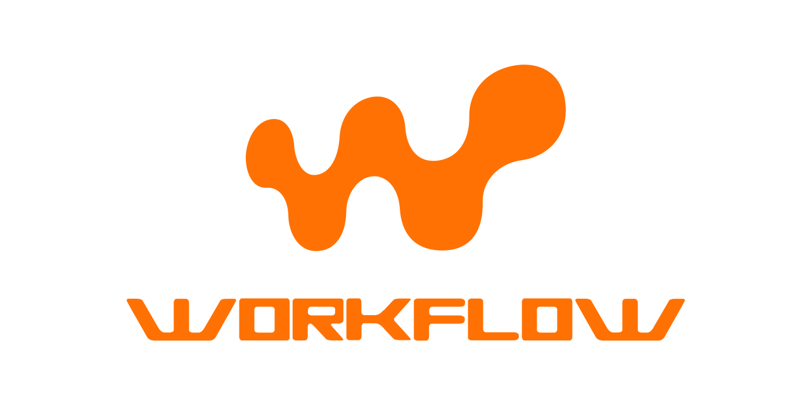

# Workflow



Namespace `Chevere\Workflow`

The Workflow package provides tooling for defining an execution procedure based on the [workflow pattern](https://en.wikipedia.org/wiki/Workflow_pattern). Its purpose is to abstract logic instructions as units of interconnected independent jobs.

::: tip 💡 Workflow introduction
 Read [Workflow for PHP](https://rodolfoberrios.com/2022/04/09/workflow-php/) at Rodolfo's blog for a compressive introduction to this package.
:::

## Installing

Workflow is available through [Packagist](https://packagist.org/packages/chevere/workflow) and the repository source is at [chevere/workflow](https://github.com/chevere/workflow).

```sh
composer require chevere/workflow
```

## Creating a Workflow

To create a Workflow define its named Jobs.

A [Job](#job) is created by passing an [Action](https://chevere.org/packages/action) and its *expected* run arguments which can be raw values,  [Variables](#variable) and/or [References](#reference) to another job's output.

The syntax for writing Workflow jobs require `name` for job's name, `sync/async` depending on job run method, and named `parameter` bding for each Action run parameter.

```plain
<name>: <sync|async>(
    <action>,
    <parameter>: <variable|reference|raw>,
)
```

For example, for the given `MyAction` action:

```php
use function Chevere\Action\Action;

class MyAction extends Action
{
    protected function main(string $foo, string $bar): array
    {
        return [];
    }
}
```

You would be able to write Workflows like this:

```php
use function Chevere\Workflow\sync;

workflow(
    greet: sync(
        new MyAction(),
        foo: variable('super'),
        bar: variable('taldo'),
    )
);
```

### With synchronous jobs

Use function `sync` to create a synchronous job, which block execution until it gets resolved.

In the example below a Workflow describes an image uploading procedure.

```php
use function Chevere\Workflow\sync;
use function Chevere\Workflow\response;
use function Chevere\Workflow\variable;
use function Chevere\Workflow\workflow;

workflow(
    user: sync(
        new GetUser(),
        request: variable('payload')
    ),
    validate: sync(
        new ValidateImage(),
        mime: 'image/png',
        file: variable('file')
    ),
    meta: sync(
        new GetMeta(),
        file: variable('file'),
    ),
    store: sync(
        new StoreFile(),
        file: variable('file'),
        name: response('meta', 'name'),
        user: response('user')
    ),
);
```

* `variable('payload')` and `variable('file')` declares a [Variable](#variable).
* `response('meta', 'name')` and `reference('user')` declares a [Response](#response) reference.

The graph for this Workflow says that all jobs run one after each other as all jobs are defined using `sync`.

```php
//$workflow->jobs()->graph()->toArray();
[
    ['user'],
    ['validate'],
    ['meta'],
    ['store']
];
```

To complete the example, here's how to [Run](#running-workflow) the Workflow previously defined:

```php
use function Chevere\Workflow\run;

run(
    $workflow,
    payload: $_REQUEST,
    file: '/path/to/file',
);
```

### With asynchronous jobs

Use function `async` to create an asynchronous job, which runs in parallel non-blocking.

In the example below a Workflow describes an image creation procedure for multiple image sizes.

```php
use function Chevere\Workflow\sync;
use function Chevere\Workflow\response;
use function Chevere\Workflow\variable;
use function Chevere\Workflow\workflow;

workflow(
    thumb: async(
        new ImageResize(),
        image: variable('image'),
        width: 100,
        height: 100,
        fit: 'thumb'
    ),
    medium: async(
        new ImageResize(),
        image: variable('image'),
        width: 500,
        fit: 'resizeByW'
    ),
    store: sync(
        new StoreFiles(),
        response('thumb', 'filename'),
        response('medium', 'filename'),
    ),
);
```

* `variable('image')` declares a [Variable](#variable).
* `response('thumb', 'filename')` and `response('medium', 'filename')` declares a [Response](#response) reference.

The graph for this Workflow says that `thumb` and `medium` run non-blocking. Job `store` runs blocking (another node).

```php
//$workflow->jobs()->graph()->toArray();
[
    ['thumb', 'medium', 'poster'],
    ['store']
];
```

To complete the example, here's how to [Run](#running-workflow) the Workflow previously defined:

```php
use function Chevere\Workflow\run;

run(
    workflow: $workflow,
    arguments: [
        'image' => '/path/to/file',
    ]
);
```

## Variable

Use function `variable` to declare a Workflow variable. This denotes a variable which must be injected by at Workflow run layer.

```php
use function Chevere\Workflow\variable;

variable('myVar');
```

## Response

Use function `response` to declare a Job response reference to a response returned by a previous Job.

🪄 When using a reference it will **auto declare** the referenced Job as [dependency](#dependencies).

```php
use function Chevere\Workflow\response;

response(job: 'task');
```

References can be also made on a response member identified by `key`.

```php
use function Chevere\Workflow\response;

response(job: 'task', key: 'name');
```

## Job

The `Job` class defines an [Action](https://chevere.org/packages/action) with arguments which can be passed passed "as-is", [variable](#variable) or [response](#response) on constructor using named arguments.

### Synchronous job

```php
use function Chevere\Workflow\job;

sync(
    new SomeAction(),
    ...$argument
);
```

### Asynchronous job

```php
use function Chevere\Workflow\job;

async(
    new SomeAction(),
    ...$argument
);
```

### Job variables and references

```php
sync(
    new SomeAction(),
    context: 'public',
    role: variable('role'),
    userId: response('user', 'id'),
);
```

For the code above, argument `context` will be passed "as-is" (`public`) to `SomeAction`, arguments `role` and `userId` will be dynamic provided. When running the Workflow these arguments will be matched against the Parameters defined at the [run](https://chevere.org/packages/action#run) method for `SomeAction`.

### Conditional running

Method `withRunIf` enables to pass arguments of type [Variable](#variable) or [Response](#response) for conditionally running a Job.

```php
sync(
    new CompressImage(),
    file: variable('file')
)
    ->withRunIf(
        variable('compressImage'),
        reference('SomeAction', 'doImageCompress')
    )
```

For the code above, all conditions must meet to run the Job and both variable `compressImage` and the reference `SomeAction:doImageCompress` must be `true` to run the job.

### Dependencies

Use `withDepends` method to explicit declare previous jobs as dependencies. The dependent Job won't run until the dependencies are resolved.

```php
job(new SomeAction())
    ->withDepends('myJob');
```

## Running Workflow

To run a Workflow use the `run` function by passing a Workflow and an `array` for its variables (if any).

```php
use function Chevere\Workflow\run;

$run = run($workflow, ...$variables);
```

Use `getResponse` to retrieve a job response as a `CastArgument` object which can be used to get a typed response.

```php
$string = $run->getResponse('myJob')->string();
```
