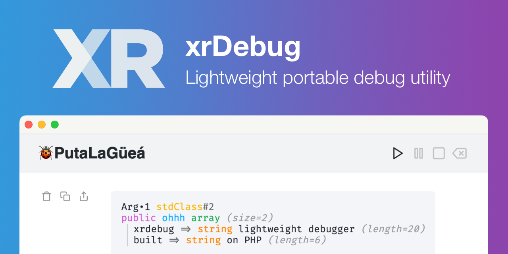

# xrDebug

The xrDebug package provides a lightweight portable debug utility.

::: tip 💡 xrDebug introduction
Read [xrDebug 1.0](https://rodolfoberrios.com/2023/10/10/xrdebug-1-0/) and [Hello, xrDebug](https://rodolfoberrios.com/2022/01/06/hello-xr/) at Rodolfo's blog for a compressive introduction to this package.
:::

| Package                                               | Description                 |
| ----------------------------------------------------- | --------------------------- |
| [xrdebug/xrdebug](https://github.com/xrdebug/xrdebug) | Debugger (server component) |
| [xrdebug/php](https://github.com/xrdebug/php)         | PHP client                  |

Check the documentation is at [docs.xrdebug.com](https://docs.xrdebug.com/).
